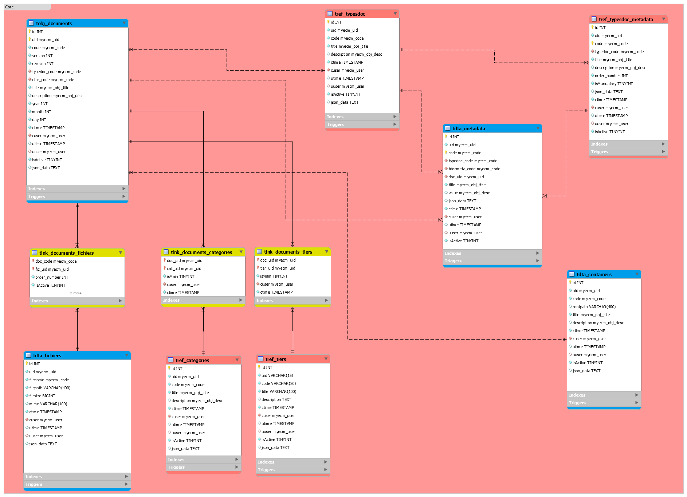

# Spécifications Base de données

## Modelisation

## Tables

| Table | Type | Spécificité(s) | Prefix CODE |Exemple de CODE|Exemple UID|
| :-----: | :------: | :------------: | :----------: | :----------: |
| tobj_documents | TAB_OBJETS | Données versionnées ... | DOC |D-FACT-2016-0001|D-FACT-2016-009|
| tref_categories | TAB_REFERENCES | Données références. Suppression logique | CAT |ADMIN|CAT-ADMIN|
| tref_tiers | TAB_REFERENCES | Données références. Suppression logique | TIER |TIER-EDF|TIER-EDF|
| tobj_fichiers | TAB_OBJETS | Données fichiers. | FIC |-|FIC-00000000001|
| tdta_containers | TAB_GENDATA | Données génériques références. Suppression logique | CTNR |DEFAULT_CONTAINER|CTNR-000003254745|
| tref_typesdoc | TAB_REFERENCES | Données références. Suppression logique | TDOC |FACT|TDOC-FACT|
| tref_typesdoc_metadata | TAB_REFERENCES | Données références. Suppression logique | TMDC |TMDC-FACT-00000001|TMDC-0000000001|
| tdta_metadata | TAB_GENDATA |  Données génériques références. Suppression logique | MDOC |MDOC-AIMP-08-02.006|MDOC-0000000001|

## Règles génériques sur attributs

| Champ(s) | Définition  | Commentaires |Exemples|
|:--------:|:-----------:|--------------|--------|
|id        | Identifiant unique interne auto calculé. | Basé sur le compteur MySQL (i.e. AUTO_INCREMENT).| 000001|
|uid       | Identifiant unique interne. | Basé sur le champ 'id' + préfix Métier.| CAT-000001 |
|cuser      | Utilisateur créateur de la donnée.| Défini à partir du compte de connexion.|polux@%|
|ctime      | Valeur TIMESTAMP de la création de la donnée.| Défini par le système.|2017-04-24 00:04:27|
|uuser      | Utilisateur de la dernière mise à jour de la donnée.| Défini à partir du compte de connexion.|eric@%|
|utime      | Valeur TIMESTAMP de la dernière mise à jour de la donnée.| Défini par le système.|2017-04-24 00:54:12|
|isActive   | Flag de suppression logique (inactive pour les nouveaux).| Sur action utilisateur.|0 ou 1|
